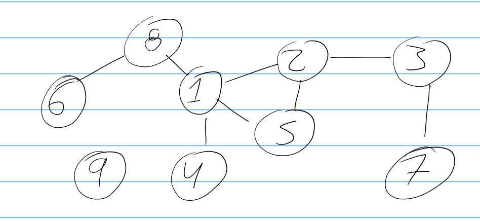

crear un grafo apartir de un adjancency list como mapa de numero del nodo, y 
value una lista de los nodos aledaños
por ejemplo el grafo

se podria pasar asi
1 -> 2,5,4,8
2 -> 3,5,1
3 -> 2,7
4 -> 1
5 -> 2,1
6 -> 8
7 -> 3
8 -> 1,6
9 -> 

la idea es almacenarlo en un adjancency list de una clase que tenga una lista 
de nodos y los nodos tengan sus vecinos